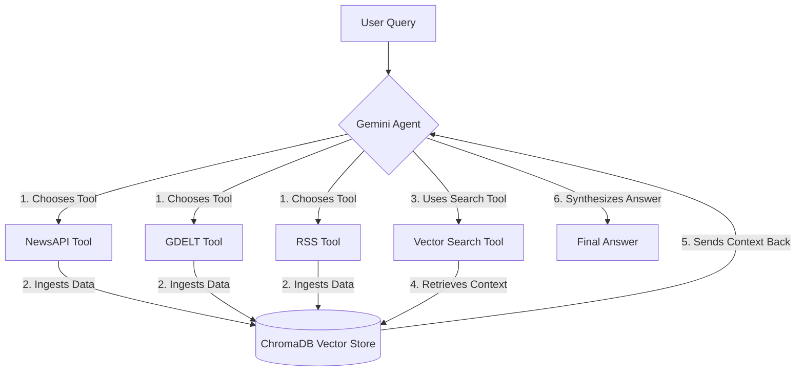

# Gemini-Powered RAG Agent for Financial & Policy News

[](https://www.python.org/downloads/)
[](https://opensource.org/licenses/MIT)

This project provides a production-ready, extensible **Retrieval-Augmented Generation (RAG)** agent designed for question-answering on topics related to finance, economics, and policy.

The agent leverages the powerful reasoning and tool-calling capabilities of **Google's Gemini Pro** model. It dynamically fetches real-time information from multiple news sources, ingests it into a local vector database, and then synthesizes an informed answer based on the retrieved context. The entire data pipeline is designed to run on free-tier services.

---

## ✨ Key Features

*   **🧠 Intelligent Agent:** Uses Google's `gemini-1.5-pro-latest` for sophisticated reasoning, planning, and tool execution.
*   **🔌 Multi-Source Data Ingestion:**
    *   **NewsAPI:** For mainstream English-language news from over 150,000 sources.
    *   **GDELT:** For global news coverage in over 100 languages, updated every 15 minutes.
    *   **RSS/Atom Feeds:** For specialist sources like central bank blogs, research institutions (IMF, ECB), or financial news sites.
*   **🚀 Local & Free RAG Pipeline:**
    *   **Embeddings:** `all-MiniLM-L6-v2` (fast, effective, and runs locally).
    *   **Vector Store:** `ChromaDB` for persistent, local storage of ingested articles.
*   **🛠️ Modern & Robust Tooling:** Built with LangChain's latest `create_tool_calling_agent` for reliable interaction between the LLM and its tools.
*   **⚙️ Extensible by Design:** Easily add new data sources, tools, or swap out the LLM with minimal code changes.

---

## 🏗️ Architecture: How It Works

The agent follows a two-step RAG process to answer questions:

1.  **Fetch & Ingest:** The user's query is first analyzed by the Gemini agent. It determines which tool (`NewsAPI`, `GDELT`, `RSS`) is best suited to find relevant articles. It calls the chosen tool, which fetches the data and "upserts" it into the local Chroma vector store.

2.  **Retrieve & Synthesize:** After loading the data, the agent uses the `vector_database_search` tool. This tool queries ChromaDB to find the most relevant document snippets based on the user's original question. These snippets are then passed back to the Gemini model, which synthesizes them into a final, coherent answer, complete with sources.



---

## 🛠️ Technology Stack

*   **LLM:** Google Gemini Pro (`gemini-1.5-pro-latest`)
*   **Framework:** LangChain
*   **Data Sources:** NewsAPI, GDELT, RSS Feeds
*   **Vector Store:** ChromaDB
*   **Embeddings:** Hugging Face `sentence-transformers`
*   **Core Libraries:** `requests`, `pydantic`, `feedparser`

---

## 🚀 Getting Started

Follow these steps to get the agent up and running on your local machine.

### 1. Prerequisites

*   Python 3.9 or higher.
*   Git for cloning the repository.
*   API Keys for:
    *   **Google AI Studio:** [Get your key here](https://aistudio.google.com/app/apikey)
    *   **NewsAPI:** [Get your free developer key here](https://newsapi.org/)

### 2. Installation

First, clone the repository to your local machine:
```bash
git clone <your-repo-url>
cd <your-repo-directory>
```

Next, create a `requirements.txt` file with the following content:
```txt
langchain
langchain-core
langchain-community
langchain-google-genai
requests
feedparser
pydantic
chromadb
sentence-transformers
beautifulsoup4
lxml
```

Now, create a virtual environment and install the dependencies:
```bash
# Create a virtual environment
python -m venv venv

# Activate it
# On macOS/Linux:
source venv/bin/activate
# On Windows:
.\venv\Scripts\activate

# Install the required packages
pip install -r requirements.txt
```

### 3. Configuration

The agent requires API keys to be set as environment variables.

**On macOS/Linux:**
```bash
export GOOGLE_API_KEY="YOUR_GOOGLE_AI_KEY_HERE"
export NEWSAPI_KEY="YOUR_NEWSAPI_KEY_HERE"
```

**On Windows (Command Prompt):**
```bash
set GOOGLE_API_KEY="YOUR_GOOGLE_AI_KEY_HERE"
set NEWSAPI_KEY="YOUR_NEWSAPI_KEY_HERE"
```
> **Note:** For a more permanent solution, consider using a `.env` file with the `python-dotenv` library or setting the variables in your system's environment settings.

---

## 💻 Usage

Run the main script from your terminal:
```bash
python gemini_rag_agent.py
```

You will see a confirmation message, and you can start asking questions.

```
Initializing Gemini-powered RAG agent...
Agent ready. Ask a news, policy, or finance question.
Type 'exit' or 'quit' to end the session.

➜  What is the latest news regarding the European Central Bank's interest rate policy?
```

### Example Questions

*   **Mainstream News (NewsAPI):** `What are recent developments in the US housing market?`
*   **Global News (GDELT):** `Find articles about supply chain issues in Southeast Asia.`
*   **Specialist Source (RSS):** `Pull the latest posts from the Bank for International Settlements RSS feed at https://www.bis.org/rss/pressrels.xml`
*   **Follow-up (RAG):** After loading data, ask: `Based on the documents, what is the current sentiment on global financial stability?`

---

## 🔧 Customization & Extension

This agent is designed to be easily modified.

*   **Change the LLM:** To use a different model (e.g., the faster `gemini-1.5-flash`), simply change the model name in the `LLM_GEMINI` initializer.
*   **Add a New Tool:** To add a new data source (e.g., the FRED API for economic data), you would:
    1.  Create a Pydantic model for the tool's arguments.
    2.  Write the Python function that calls the API.
    3.  Wrap it in a `StructuredTool`.
    4.  Add the new tool to the `TOOLS` list.
*   **Adjust Retrieval:** You can modify the `_vector_search` function to change the number of retrieved documents (`k=8`) or the time filter (`days=30`).

---

## 📜 License

This project is licensed under the MIT License. See the `LICENSE` file for details.
